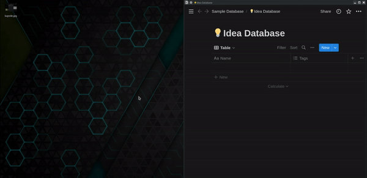

# Notion Quick Add



## Prerequisites to Make This Run

- Bash
- Node

## Integrate your Notion Database here

- To add integration, follow the steps [here](https://developers.notion.com/docs/create-a-notion-integration) to step 3. (It shouldn't take up to 3 minutes)

- Create a new file called `.env` at the root of this project and replace and update the secrets from your Notion workspace.

```text
NOTION_TOKEN=<your_notion_token>
NOTION_DATABASE_ID=<your_database_id>
```

## Install the project dependencies

- Install the project dependencies by running the command:

```bash
yarn install
```

## Start the Electron App in Local Development

- Start the app by running the command

```bash
yarn run start
```

## Creating a Keyboard Shortcut to Opening this Application

The purpose I created this application is to create a way to easily add new items to a database I keep for ideas. I need a way to quickly add ideas as they pop up in my mind with the most minimal effort to not disrupt my focus.

I use Arch Linux as my daily driver (work, study, etc) so I was able to create a keybinding shortcut to run the electron app without having to use or open a terminal.

## Contribution

If you find this tool useful, please leave a star so other people can know more about it.

How can you contribute:

- create issues with your suggestions
- submit PRs to improve the project
- submit PRs describing how you setup keyboard shortcuts using:
  - Any Linux distro
  - Window
  - macOS
